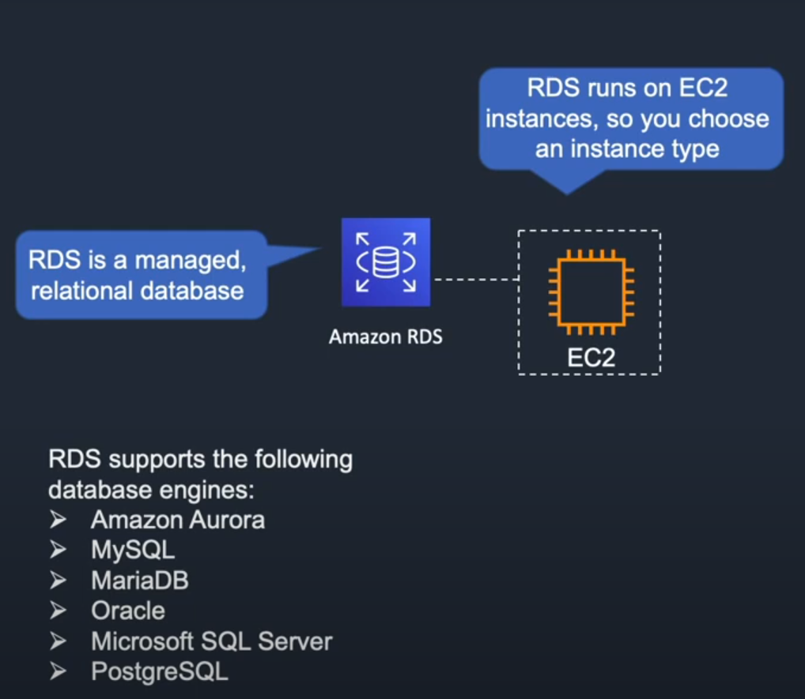
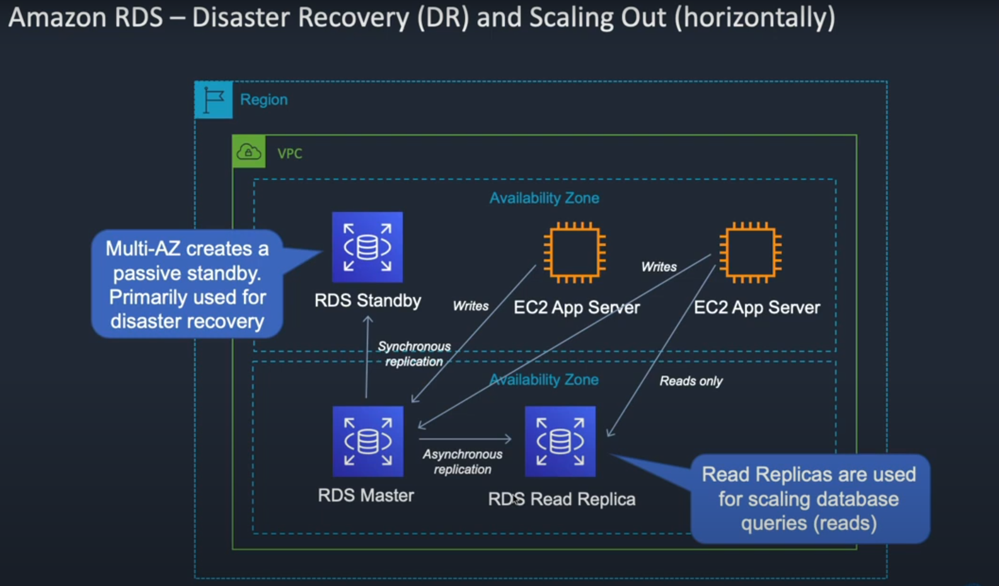

RDS also has a feature called DR (Disaster Recovery) which is really useful. You can have 2 availability zones inside of you VPC. In 1 resides the master where data will be written, it performs a synchronous request to the backup database which resides in the second AZ (availability zone). You can also had an RDS Read Replica which is a copy of the master and set it so that users will be reading from there. 

When data is written to the master it asynchronously copies it to the RDS Read Replica database.