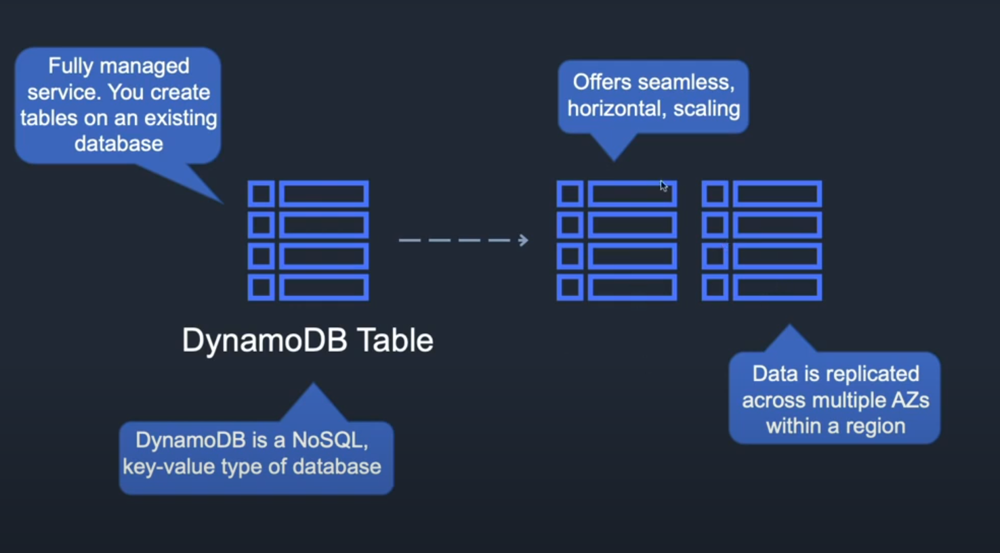
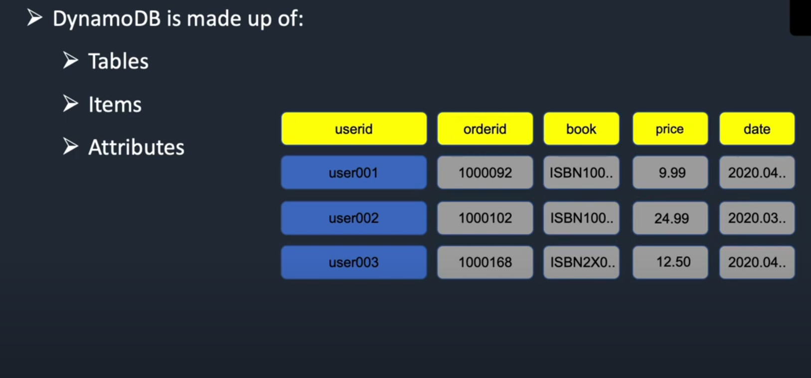
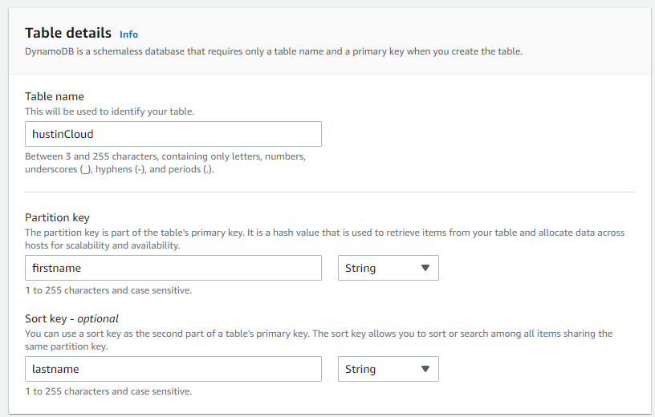

With DynamoDB you insert tables to an already existing Amazon database.

Services -> DynamoDB -> Create table 



Click create.

Then you can go into the table and start adding values.

You can create a schema:

"DynamoDB CLI Commands.sh"
"mystore.json"

```
# Import data
aws dynamodb batch-write-item --request-items file://mystore.json
```

It should show:

```
"UnprocessedItems": {}
```

Now if you go back to AWS the table should be auto populated with the data from mystore.json.

The batch-write-item is an api command that allows us to write items and we took the items from the json file. We are actually performing a PUT (update) request!

We can scan the database with the following command:

```
# Perform scan of ProductOrders table:
aws dynamodb scan --table-name mystore
```

We can also query from the terminal using:

```
# Use Key-Conditions Parameter:
aws dynamodb query  --table-name mystore --key-conditions '{ "clientid":{ "ComparisonOperator":"EQ", "AttributeValueList": [ {"S": "chris@example.com"} ] } }'

# Use Key-Condition-Expression Parameter:
aws dynamodb query --table-name mystore --key-condition-expression "clientid = :name" --expression-attribute-values '{":name":{"S":"chris@example.com"}}'
```


