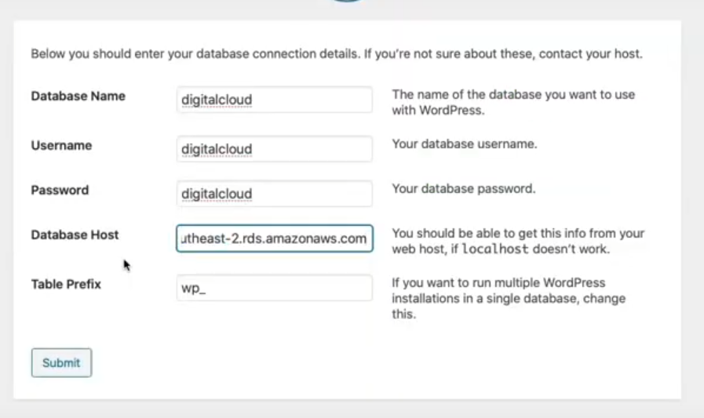

EC2 -> instances -> launch instance -> amazon Linux -> leave all the default options -> security groups select Web-Access

When the EC2 is ready, click the overview for it and copy the IPv4 address

Then in the terminal run:

```
ssh -i London-HK.pem ec2-user@your-public-ipv4-address
```

"RDS/install-wordpress.sh"

```
sudo su
```

```
yum update -y
```

```
amazon-linux-extras install -y php7.2 
yum install -y httpd
systemctl start httpd
systemctl enable httpd
cd /var/www/html
wget https://wordpress.org/latest.tar.gz 
tar -xzf latest.tar.gz
cp -r wordpress/* ./
chmod -R 755 wp-content
chown -R apache:apache wp-content
```
Then go back to AWS and open the public IPv4 address in the browser and wordpress should appear!



Go back to your database and copy the end point into the Database Host.

Then check what security group your database is using by clicking on it. 

Inbound rules -> edit inbound rules -> remove the default rule -> add in MySQL for the type and type sg in the source for it to bring up Web-Access -> save.

This will allow inbound traffic from the EC2.

Hit submit in wordpress. It will then populate a wp-config.php file that you need to copy.

Create the wp-config.php using "nano" while you are in the html path in the terminal.

Back on wordpress click run installation. Enter information needed and click install wordpress.


