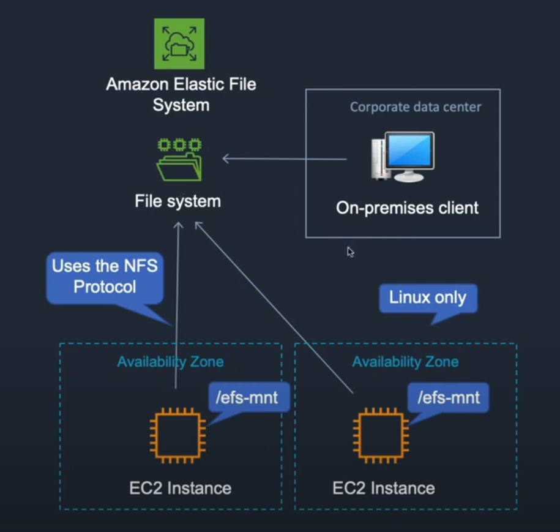
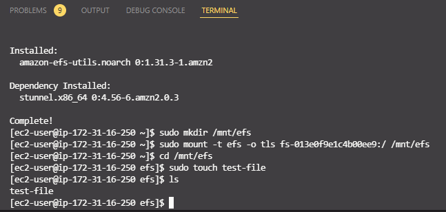

EFS Elastic File System



Create a new instance, make sure it's using a Linux AMI and pick a subnet to put it in -> next -> Web-Access security group

Create another instance but pick a different subnet.

Storage -> EFS -> Create -> Name it and create it.

Go back to your 2 instances and copy the ssh address. Paste these in 2 separate terminals.

EC2 -> Security groups -> Web-Access -> inbound rules -> add NFS -> for the source, set it to sg and this will mean that it will allow inbound NFS from any instance that is using the Web-Access security group.

EFS -> Network -> Manage -> Change the security groups to match the EC2 security group we just did -> save -> attach 

"connect-to-efs-filesystem.sh" 

Run this command in the terminal in our 2 terminals for previous:

```
sudo yum -y install amazon-efs-utils
```

Then run the following to create a directory for our mount point:

```
sudo mkdir /mnt/efs
```

Now run the command to connect the file system:
```
sudo mount -t efs fs-af29dd97:/ /mnt/efs
```

But just note that you need to use the EFS mounter helper code that was in attach on line 15. In my case it is:

sudo mount -t efs -o tls fs-013e0f9e1c4b00ee9:/ efs

Notice on line 33 we need to include /mnt/ before efs

Now we can cd into the new directory and create a test file:

```
cd /mnt/efs

sudo touch test-file
```



Now in the other terminal you can cd to /mnt/efs and run ls. You will see the test-file. This means that both instances have access to the same filesystem! 


