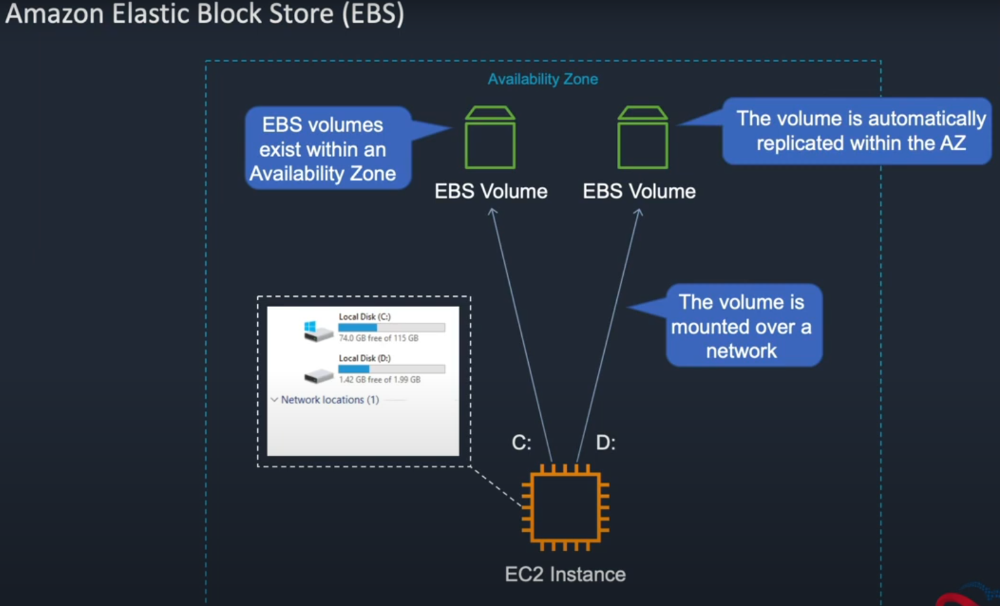

EBS (Elastic Block Store) Volumes are essentially drives that you can store to an EC2 instance. (Windows and Linux drives) For example C:

EBS resides in the EC2 service on the AWS site.

This is where you can create your network drive.

Instances -> Launch -> windows server -> you need to pick subnet that shares the same availability zone as the EBS volume that was created. -> for security groups choose Web-Access (created this in an earlier lesson)

Port 3389 needs to be created for the remote desktop protocol for the security group as we are using a Windows AMI.

Launch the instance.

Security groups -> select Web-Access and create an inbound rule:

Add rule -> allow RDP (remote desktop protocol) -> set the address as 0.0.0.0 -> save rules.

Instances -> connect -> RDP client -> get password -> upload key pair file -> decrypt password

Copy the public DNS name.

In your remote desktop client you need to add a new pc and paste the public DNS in there, add the Administrator username and paste in the decrypted password.

EBS (Elastic Block Store) -> Volumes -> right click the EC2 volume and you can now search for the instance and click attach.

On Windows under disk management you can then see the EC2 network drive show up and initiate it.

Back on AWS you can select the volume -> actions -> detach to remove it from the pc.

