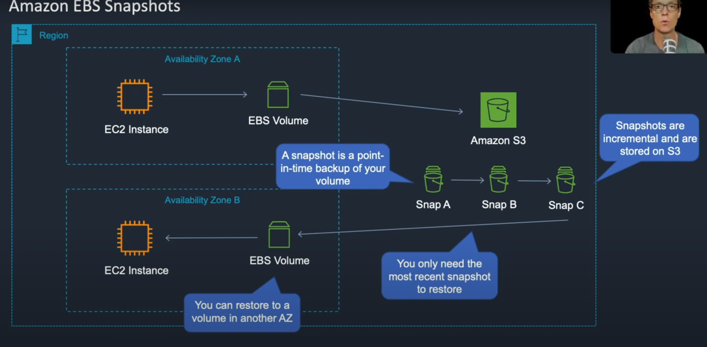

EC2 -> EBS -> Volumes -> select your volume, right click and select create a snapshot -> add a description -> create

EBS -> Snapshots 

EC2 -> Instance -> Create new instance -> choose a different subnet from where the initial volume was created -> next -> add your security group and launch the instance.

EBS -> Snapshots -> select your snapshot -> actions -> create volume -> general purpose ssd -> change availability zone to the new subnet you set.

EBS -> Volumes -> select the new volume that was created by the snapshot -> attach volume -> attach it to your instance -> attach.

Instances -> connect -> copy DNS name and paste into Microsoft Remote Desktop -> copy the password and enter it into MRD.
Disk Management -> your instance volume should be there.