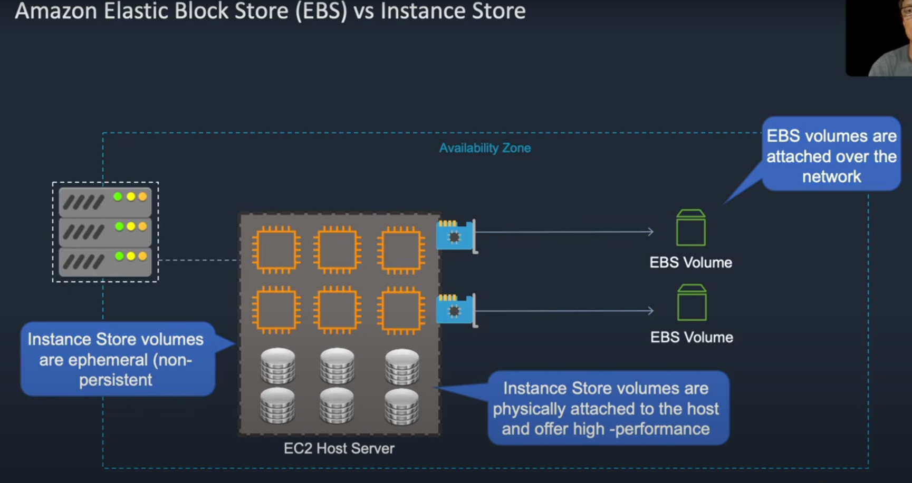

Instance store is good for temporary data, the downside to this is that when you shutdown the instance, all data is lost.

When you create an instance it will show you which ones are EBS Elastic Block Store or and which ones are instance stores.