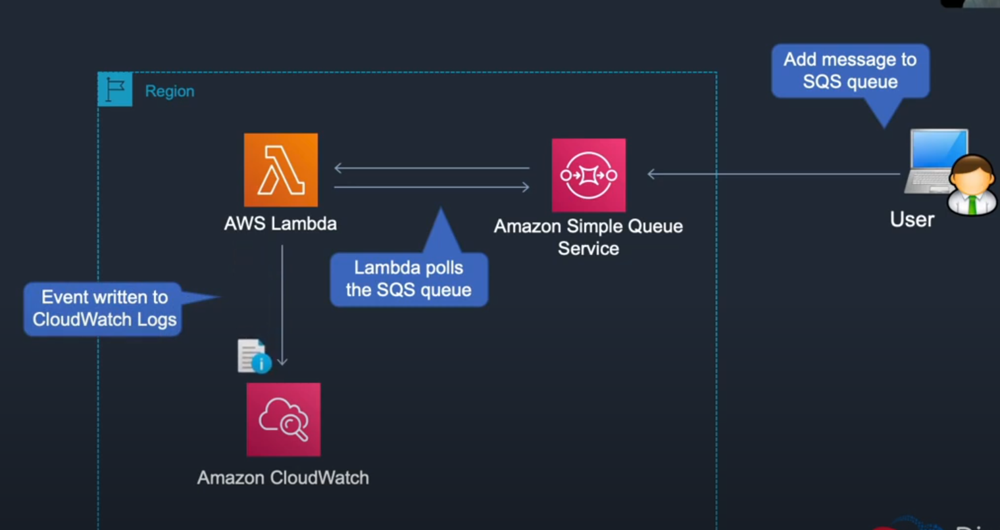
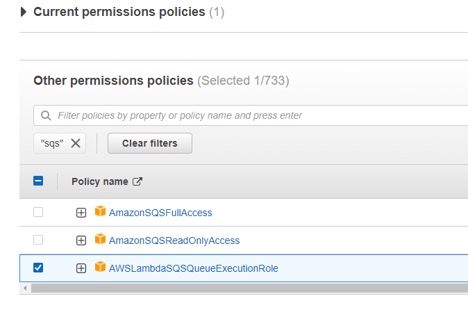
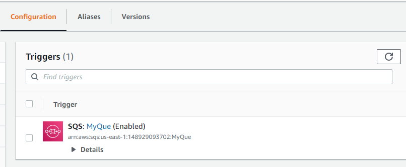
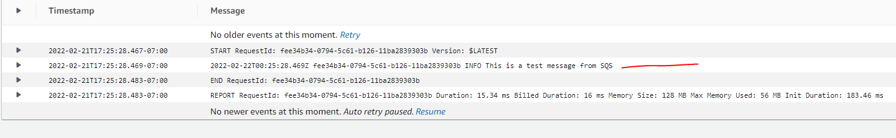

Services -> Compute -> Lambda - Create a new function

- name (SQS-SNS)
- runtime (NodeJS)
- execution role (create a new role with basic permissions)

Create function -> delete the standard "hello world"

"event-source-mapping-sqs-to-lambda.js"

```
exports.handler = async function(event, context) {
  event.Records.forEach(record => {
    const { body } = record;
    console.log(body);
  });
  return {};
}
```

Paste this code in and hit deploy.

Configuration -> permissions -> click on the role name and it will open up the IAM service.

Check the box and select the add permissions drop down -> attach policies

Search for SQS and you will a policy with execution role:



Attach policy

Back in configuration there is a tab labeled "triggers". When we create our que a trigger will be created.

Services -> Application Integration -> Simple Que Service -> Create que

Name it and hit Create que.

Hit the Lambda Triggers tab -> Configure Lambda function trigger -> click on the drop down and select your function (SQS-SNS).

Now that should have configured the mapping between SQS and AWS Lambda.

Back in the Lambda console you will see the new trigger that we created!



Back in the SQS console the way we can test this is by hitting the send and receive messages button.

Go back into Lambda and hit the monitor tab, click view logs in CloudWatch.

