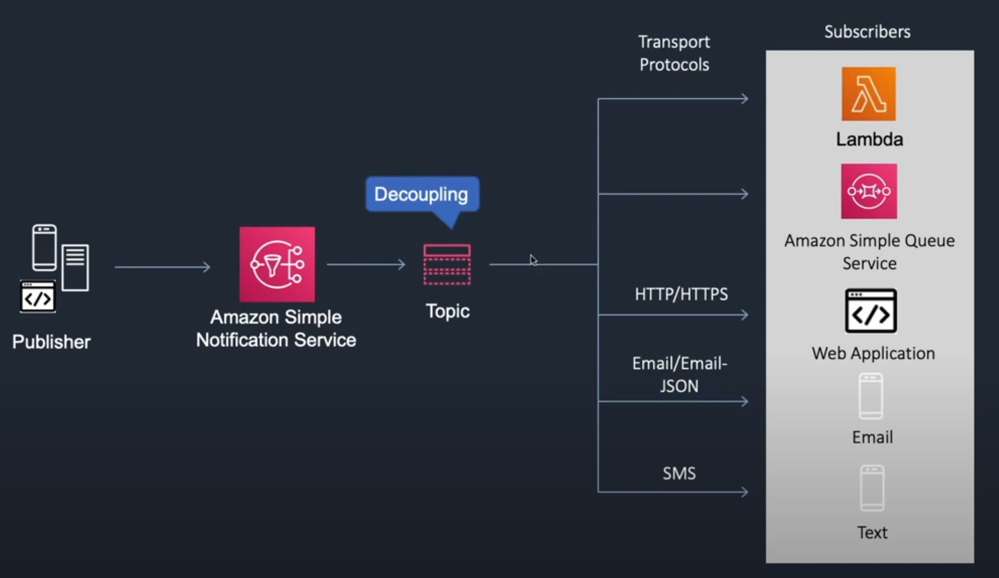
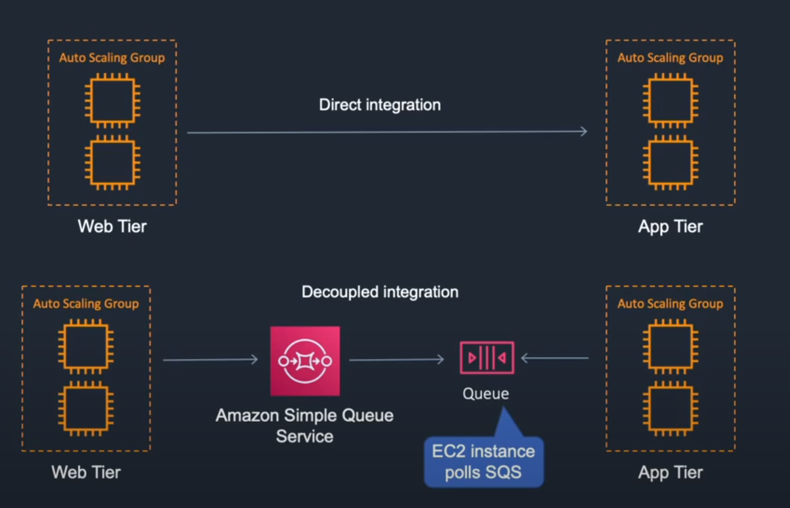

SNS Simple Notification Service

This is a decoupling example where the publisher sends a message to the subscriber but in between that connection a top is created. So what this means is that there is not a direct message passed from the publisher and the subscriber. The topic acts as a middle man.

SQS Simple Que Service

This AWS message que, with this service a que is created. If the Web Tier sends messages directly to the app tier it can create a lot of load so what the que does is it pretty much stores the messages in a que and whenever the App Tier is ready for it, then it will grab it. 