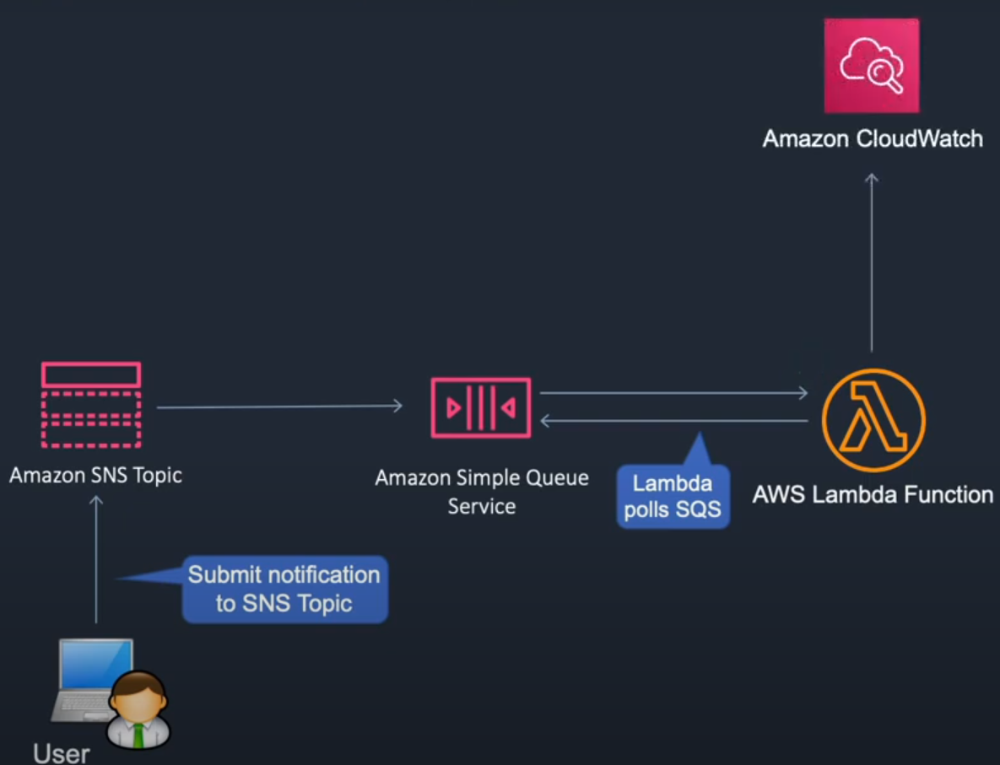
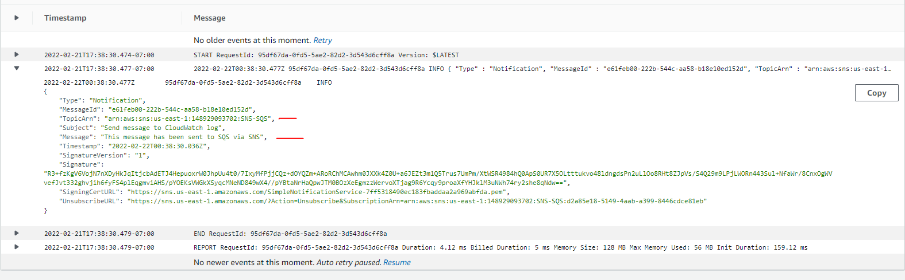

In this lesson we are extending the architecture from before and adding SNS Simple Notification Service to it.

Services -> Application Integration -> Simple Notification Service -> Create new topic

- name (SNS-SQS)

Create topic

Now go back to SQS because we need to configure it to be a subscriber to our SNS topic.

SNS subscriptions -> subscribe to SNS subscriptions -> select SNS-SQS.

Now go back to the SNS console and click publish message.

So what happed is the user (me) published a message to the SNS topic, the SQS que will receive the message and Lambda will trigger the function and write the message to CloudWatch log.

We successfully sent the message! User -> SNS -> SQS -> Lambda -> CloudWatch

