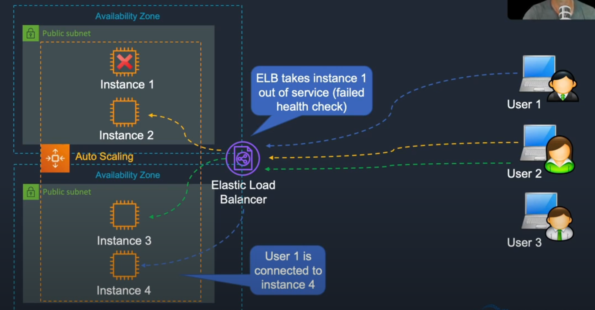
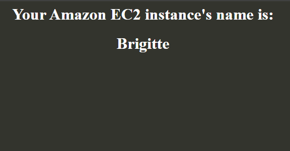

The Elastic Load Balancer monitors the health of the instances and has the ability to take an instance out of service.

It connects to the instances. It can communicate to auto scaling and then ASG can launch a new instance.

EC2 -> Load Balancers -> Create an application load balancer -> under network mapping select your subnets -> select your security group -> create target group under Listeners and routing -> then add the newly created target group under "forward to" -> create load balance

Then we need to connect our auto scaling group to it.

EC2 -> launch templates -> create launch template -> select AMI and instance, attach Web-access security group -> advanced details -> IAM role: S3-Read Only, user data: "code and files directory -> "user-data-to-create-index-html-with-names.sh"

Copy the code from there and paste it into user data.

Create launch template.

Auto scaling groups -> create an auto scaling group -> name it and choose the LT1 template from which we created earlier -> next -> attach load balance from existing, choose the TG1 balance we created -> Health checks -> tick ELB (elastic load balancer) -> next all the way through -> create auto scaling group

You can view the initialization status by going to load balancing -> load balancers or target groups (should say healthy when ready in target groups)

Load balancing -> load balancers -> Basic config: copy the DNS name.

Paste it in the browser and we can the result of the name being randomized on each page load.

When you are finished just go to load balancers and delete the TG1 balancer we created.

Delete the target group and auto scaling group too.
