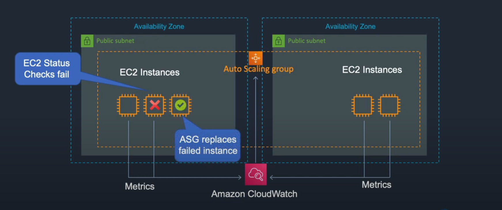
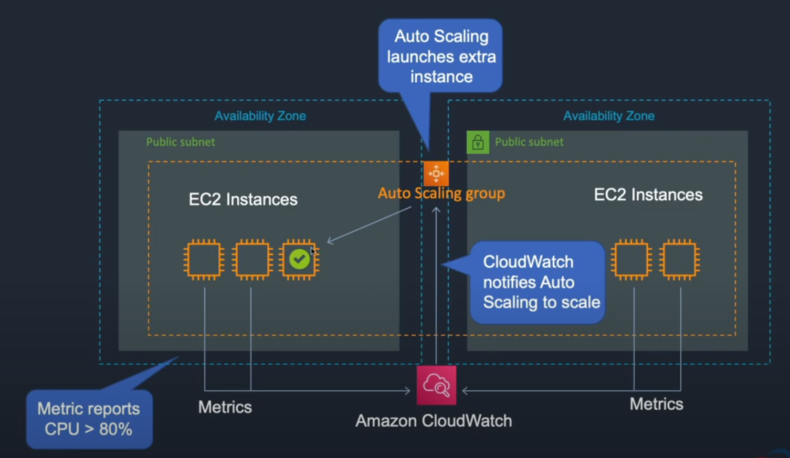
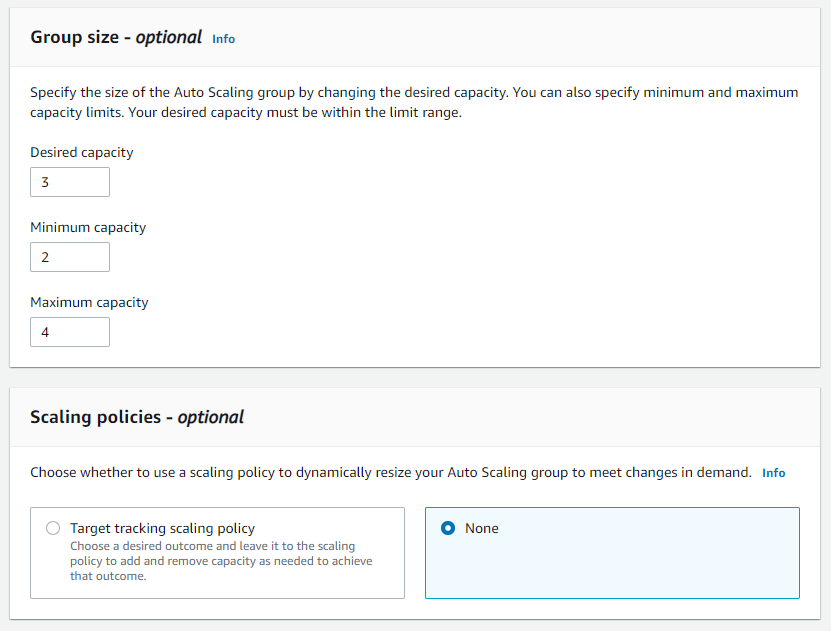
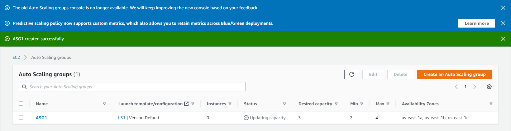
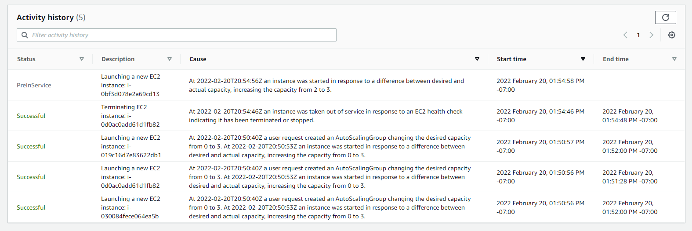
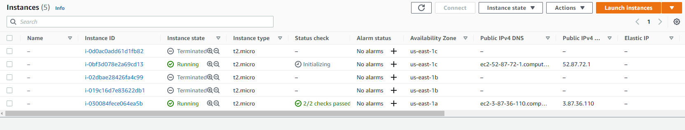

EC2 auto scaling is a service that can run and terminate EC2 instances.

It can do this with instances that have failed as well as determine the amount of pressure that your system is under.

For example you can set a CPU threshold and if the system exceeds it, you can trigger a termination on that instance or launch a new one.

 

 In the screenshot we can see a failed instance, this gets reported back to CloudWatch and the ASG (Auto Scaling Group) triggers a new instance.

 

 In this screenshot the CPU usage is over 80% and the report is sent to CloudWatch and ASG triggers a new instance.

 EC2 -> Auto Scaling Groups -> Create Auto Scaling Group -> Name it and click on create launch template -> name it and select an AMI -> select an instance -> Choose your key pair -> put it into a VPC -> create the template

 Go back to Auto Scaling Groups -> choose the launch config we just made -> next -> we have our default VPC selected now we have to select our subnets -> next -> we can add load balancing and perform health checks every number of seconds -> next -> we then create a group size and scaling policy

 

 It will launch 3 instances, it should never go under 2 and it can go up to 4.

 The scaling policy can dynamically resize the group.

 Hit next until the very end and click create auto scaling group.

 

 To test this we can go back to our instances (remember we created 3), select 2 and hit terminate

 

 The ASG noticed that we terminated 2 instances and has booted up another 2!

 

 We can see here that the instances have started up again.

 