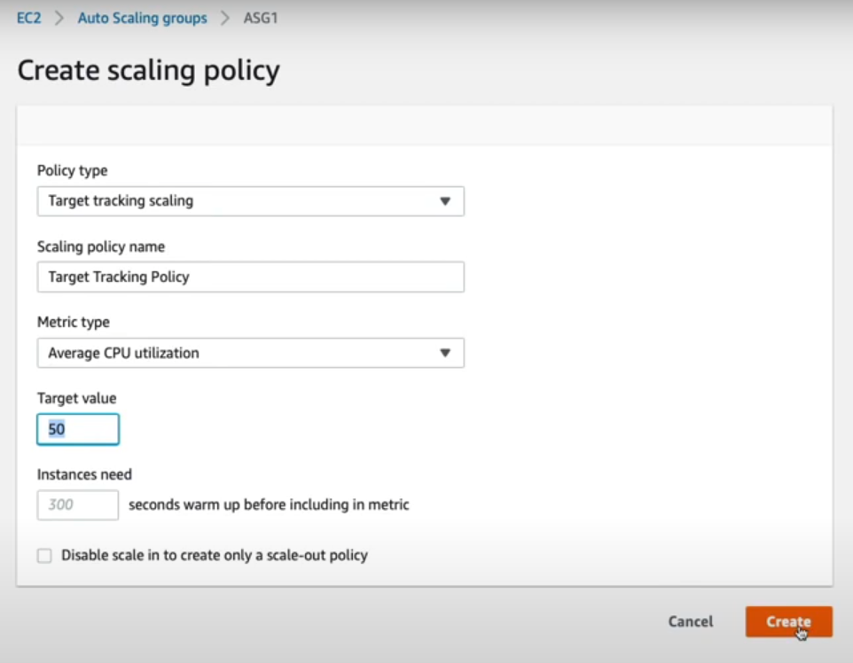
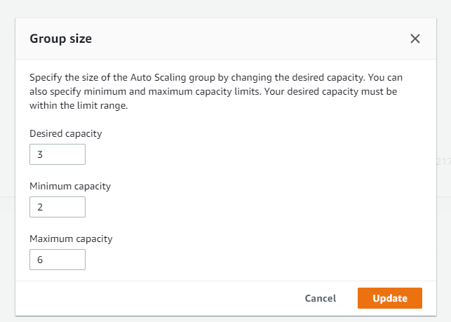

In this lesson I am going to add CPU load and trigger the ASG to take action.

Connect to all 3 instances using ssh

Auto scaling groups -> ASG1 (or whatever you named it) -> automatic scaling -> add policy 



It's going to target track and the CPU threshold value is as 50.



Now if you check the instances, 1 of the 3 will be terminated because we have a base line starting at 2 instances.

Then there is a file provided named "install-stress-util-ec2.sh" and we can run those commands to install the stress test.

```
stress -c 8
```

This will initiate the stress test.

CloudWatch takes 5 minutes to report the stress (Enable Detailed Monitoring is a paid service and updates every 1 minute)