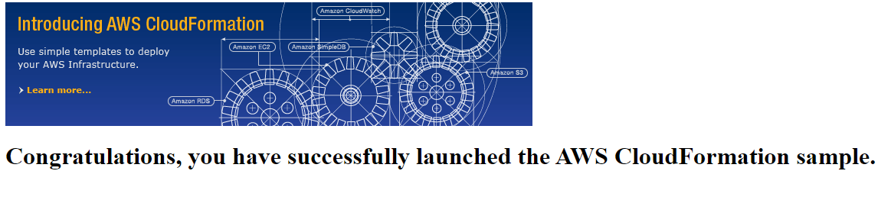

Services -> Management & Governance -> CloudFormation -> Create stack -> Upload template file "Load-balanced-auto-scaling-group.json" -> next -> 

- name the stack 
- instance type t2.micro for free tier
- add key pair
- add subnets
- add vpcid

Once the stack has been created you will see an url under:

Cloudformation -> Stacks -> Output -> url

It is likely that the url will not load because there is an issue with the security groups. The default security group allows connectivity from inside that vpc but does not allow internet traffic.

You need to edit the security group and open up port 80 and set the source as 0.0.0.0 to allow access to the internet gateway.

If all succeeds the url should render:

