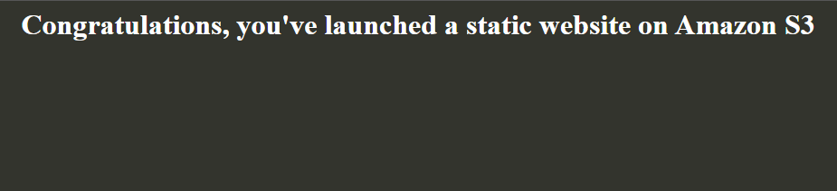

Services -> Management & Governance -> CloudFormation -> Create stack -> Upload template file "CloudFormation/EC2Instance.yml" -> next -> name the stack -> next -> create stack.


```
Resources:
  MyInstance:
    Type: AWS::EC2::Instance
    Properties:
      AvailabilityZone: us-east-1a
      ImageId: ami-0a887e401f7654935
      InstanceType: t2.micro
```

Some more template examples:

"CloudFormation/EC2InstanceMappings.yml"
```
Mappings:
  InstanceMap:
    us-east-1:
      dev: t2.micro
      prod: m1.small
    us-west-1: 
      dev: m1.small
      prod: m1.large
  AMIMap:
    us-east-1:
      dev: ami-0a887e401f7654935
      prod: ami-0a887e401f7654935
    us-west-1:
      dev: ami-01c94064639c71719
      prod: ami-01c94064639c71719
Resources:
  MyInstance:
    Type: AWS::EC2::Instance
    Properties:
      ImageId: !FindInMap [AMIMap, !Ref "AWS::Region", dev]
      InstanceType: !FindInMap [InstanceMap,!Ref "AWS::Region", dev]
```
"CloudFormation/EC2InstanceParameter.yml"
```
Parameters: 
  InstanceTypeParameter: 
    Type: String
    Default: t2.micro
    AllowedValues: 
      - t2.micro
      - m1.small
      - m1.large
    Description: Enter t2.micro, m1.small, or m1.large. Default is t2.micro.
Resources:
  MyInstance:
    Type: AWS::EC2::Instance
    Properties:
      AvailabilityZone: us-east-1a
      ImageId: ami-0a887e401f7654935
      InstanceType: 
        Ref: InstanceTypeParameter
```

You can also create an S3 bucket with cloudformation:

This time upload "CloudFormation/S3Bucket.yml"

```
Resources:
  DigitalCloud:
    Type: AWS::S3::Bucket
    Properties:
      AccessControl: PublicRead
      WebsiteConfiguration:
        IndexDocument: index.html
        ErrorDocument: error.html
```

Go to the newly created S3 bucket and upload the error.html and index.html files.

Select them both -> actions -> make public

In the bucket -> properties -> at the bottom it will say Static website hosting and there will be a link.



To delete these stacks do the following:

MyEC2Instance you can simply click delete and it will take care of everything.

The S3 bucket however will fail because there are objects in the bucket (the error and index files) so we need to delete them from the bucket first.

