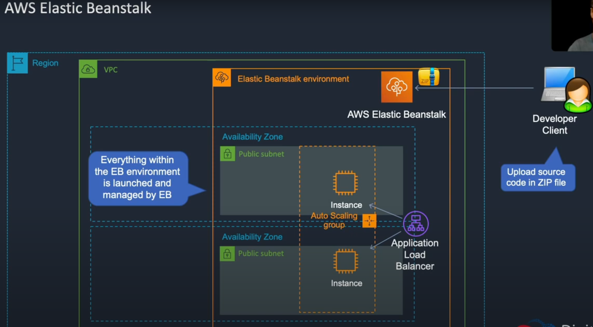
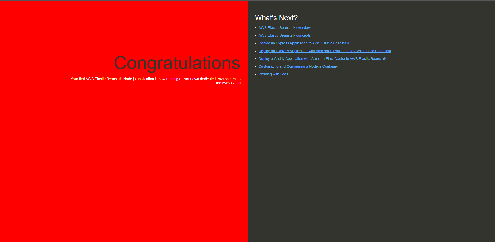

AWS Elastic Beanstalk:

With Elastic Beanstalk you can upload your source code in a zip file and Elastic Beanstalk will then build everything in this environment.

It will create the load balancer, ASG auto scaling group, instances and then configures the code so that your application will run.

Services -> Compute -> Elastic Beanstalk -> create application ->

- name (mynodejsapp-source)
- platform (node.js)
- upload code (nodejs-red.zip) 

-> create application

Once Elastic Beanstalk is done configuring there will be an url:

