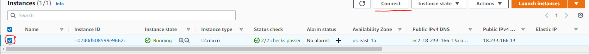
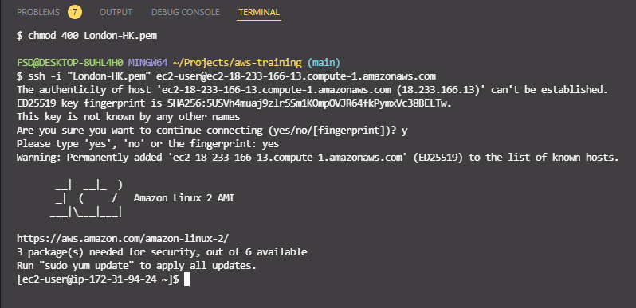

How to connect to the instance I just created.

In EC2 -> instances, switch your region (I used Singapore)

launch instance -> windows server 2019 base -> go through to security groups

This time the type will not be SSH, it will be RDP because we are launching a Windows server. RDP uses port 3389 to listen.

Create a new key pair and download it. Launch the instance

Switch back to your region (N. Virginia for me)



Make sure the drop box is selected and then click connect -> SSH client

Open an SSH client.
Locate your private key file. The key used to launch this instance is London-HK.pem
Run this command, if necessary, to ensure your key is not publicly viewable.
 chmod 400 London-HK.pem
Connect to your instance using its Public DNS:
 ec2-18-233-166-13.compute-1.amazonaws.com
Example:
 ssh -i "London-HK.pem" ec2-user@ec2-18-233-166-13.compute-1.amazonaws.com

 

To run an update we can type:

```
sudo yum update -y
```


