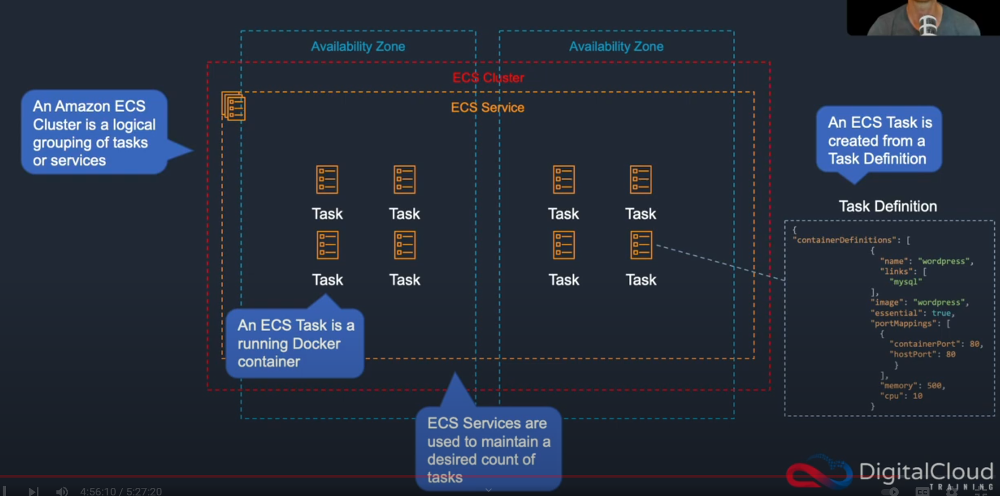
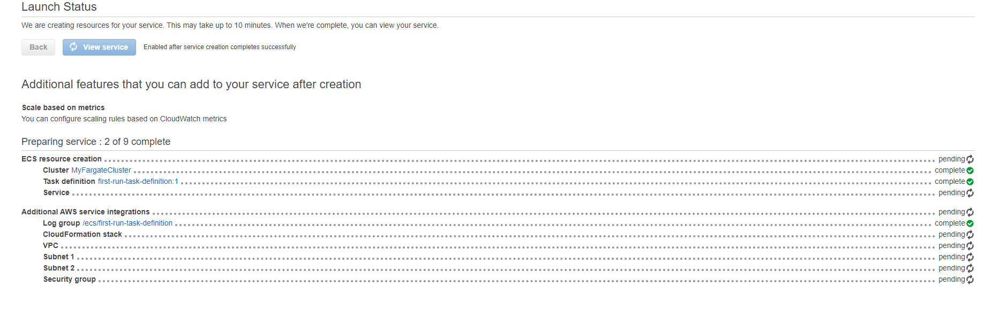
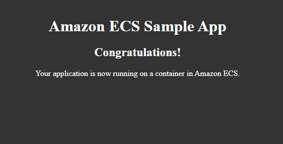

Elastic Container Service:

Services -> Containers -> Elastic Container Service -> Get started

- sample app

next -> define your service

- load balancer type (you can define a load balancer, the lesson chose none)

next -> configure your cluster
- cluster name (MyFargateCluster)

next -> create now

Services -> CloudFormation -> Stacks

You can view the components that the ECS is creating 

Go back to the Elastic Container Service and click on tasks -> run new tasks

- launch type (fargate)
- task definition -> family (first-run-task-definition)
- security groups (by default it should give you port 80 and be accessible anywhere so we do not need to use the Web-Access security group we created)

Run task ->

There will be a public ip address created that you can put into the browser:

