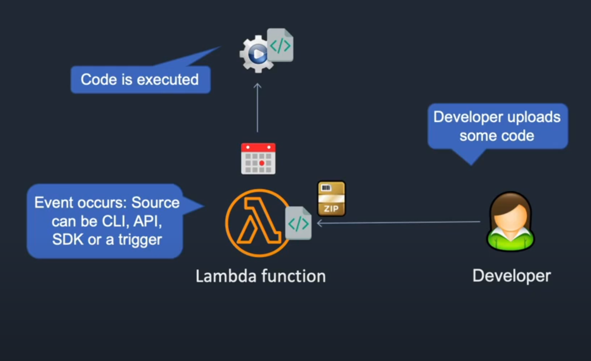
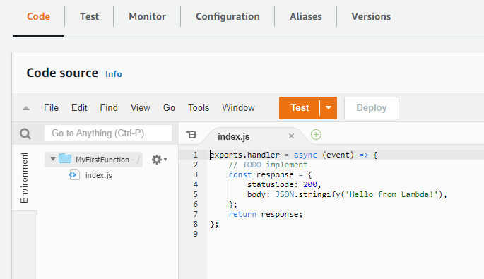
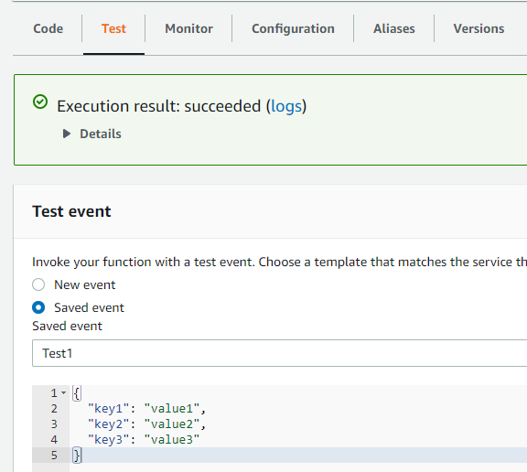

With Lambda you don't need to manage any EC2 instances, operating systems or other services. You literally just upload your code to Lambda. Lambda is event based driven, so an event becomes a trigger to execute your code. 



Services -> Compute -> Lambda -> Create function

- Function name (MyFirstFunction)
- Runtime (NodeJS)

Permissions -> 

Lambda needs an IAM role to have right and permissions to other services. By default it will have basic permissions and that is what we will use in this lesson.

Click create function

Under code you will see a simple function that returns "Hello from Lambda"



If you click the configuration tab ->

Concurrent: This determines the number of concurrent executions of your functions.

Permissions: If we click on the role it will take us to the IAM service and from here we can click the role and view it as a JSON object:

```
{
    "Version": "2012-10-17",
    "Statement": [
        {
            "Effect": "Allow",
            "Action": "logs:CreateLogGroup",
            "Resource": "arn:aws:logs:us-east-1:148929093702:*"
        },
        {
            "Effect": "Allow",
            "Action": [
                "logs:CreateLogStream",
                "logs:PutLogEvents"
            ],
            "Resource": [
                "arn:aws:logs:us-east-1:148929093702:log-group:/aws/lambda/MyFirstFunction:*"
            ]
        }
    ]
}
```

Go back to Code and delete the function. We are going to paste some new code.

"Lambda/write-to-cloudwatch-logs.js"

```
exports.handler = async function(event, context) {
    console.log("ENVIRONMENT VARIABLES\n" + JSON.stringify(process.env, null, 2))
    console.info("EVENT\n" + JSON.stringify(event, null, 2))
    console.warn("Event not processed.")
    return context.logStreamName
  }
```

Then click on deploy -> click on test

- event name (test1)

Click on create. Then we need to test it:



Click on monitor and then view logs in CloudWatch.

With Lambda you only pay whenever the function is executed.

