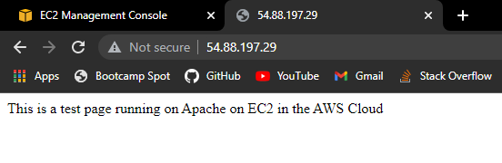

There is a file on the root called:

```
ec2-instance-user-data
```

This file allows me to install web server

```
#!/bin/bash
yum update -y
yum install httpd -y
systemctl start httpd
systemctl enable httpd
cd /var/www/html
echo "This is a test page running on Apache on EC2 in the AWS Cloud" > index.html

# Test with this command:
curl http://169.254.169.254/latest/user-data
```

Bash is the interpreter we use, this is what will be used to run the commands

Yum is used to update the packages

yum install will install an apache webserver

systemctl start httpd starts the webserver

systemctl enable httpd makes sure that it keeps starting when we restart the system

cd /var/www/html we navigate to this directory and this is where we create our document

echo "This is a test page running on Apache on EC2 in the AWS Cloud" > index.html (this command will write into index.html)

Highlight the code, click on copy -> launch instance (on aws site) -> amazon linux 2 AMI -> navigate to step 3 and scroll down to user data -> paste the code in (lines 1 - 7) -> security group -> select existing group -> select your security group -> launch -> select your key pair

security groups -> select your security group to edit -> inbound rules -> edit inbound rules -> add rule -> HTTP (this will open up port 80 for our website) -> change the source to make it access the internet gateway (0.0.0.0/0) -> save rules

Go back to instances, check your instance, in the description there will be a public ipv4 address, copy it. Open a new tab and paste it in the address bar

