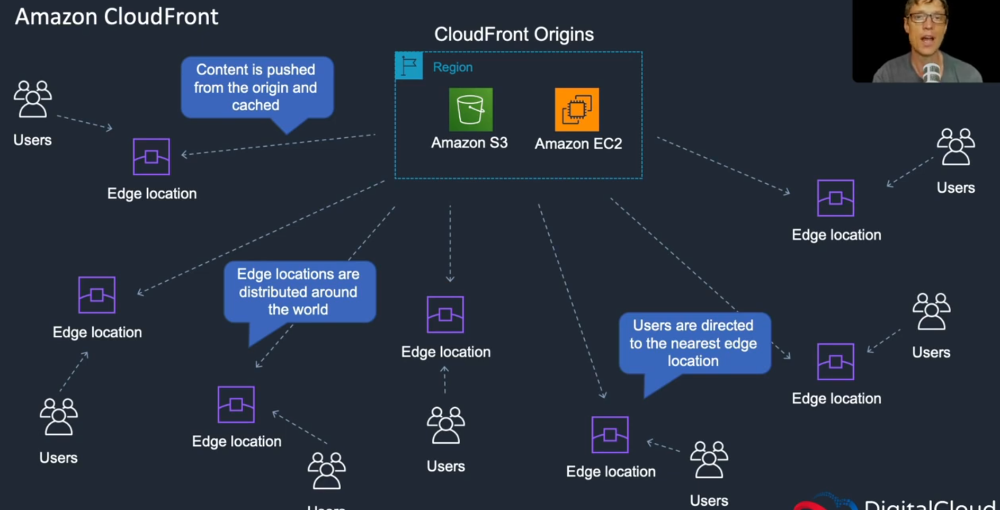

CloudFront is great to use for media. It improves latency (performance). What you can do with CloudFront is move the content around the world so it's easier global users to access.

S3 Bucket -> Permissions -> 

- Turn the bucket to public 

Access control list -> List objects 

- List objects

Go back to the bucket level -> properties -> static website hosting

- index document (index.html)
- error document (error.html)

Creating a CloudFront distribution:

Services -> Networking & Content Delivery -> CloudFront 
Create distribution -> Get started (Web)

- origin domain name (choose your domain bucket)
- restrict bucket access (yes)
- origin access identity (create new identity, what this means is that users will only be able to access the bucket)
- grant permission on bucket (yes)

Distribution Settings ->

- price class (you can choose where you want the edge locations for caching)

Click create distribution