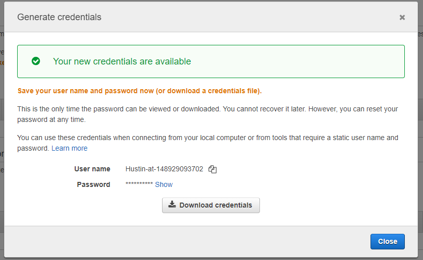

Services -> Developer Tools -> CodeCommit -> Repository -> Create Repo

- repo name (MySourceRepository)

Clone the repo
git clone https://git-codecommit.us-east-1.amazonaws.com/v1/repos/MySourceRepo

In order to be able to clone the repo you need to gram your IAM Git credentials

Services -> IAM -> Users -> Hustin -> Security Credentials -> HTTPS Git credentials for AWS CodeCommit -> Generate Credentials

I added the files previously used in "nodejs-red.zip" and changed the background color for a simple test.

CodePipeline -> Pipelines -> Create new pipeline

- Name (MyTestPipeline)
- Role name (AWSCodePipelineServiceRole-us-east-1-MyTestPipeline)
- Source Provider: AWS CodeCommit (There is also an option for GitHub!)
- Repo name (MySourceRepo)
- Branch name (master)

For the build provider you could use AWS CodeBuild to test your code or use Jenkins but we are not doing that in this lesson. 

- Deploy provider (Elastic Beanstalk)

Create pipeline

Successful deployment!!!

