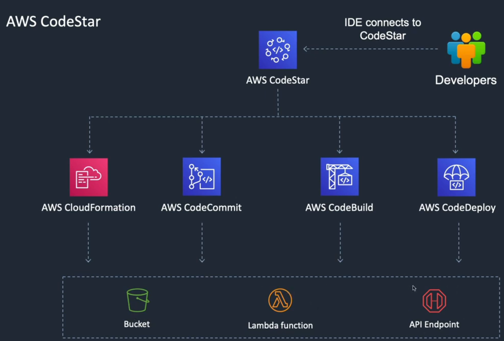
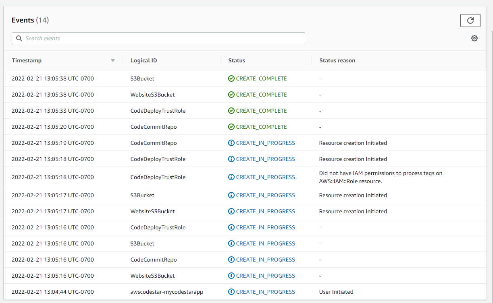
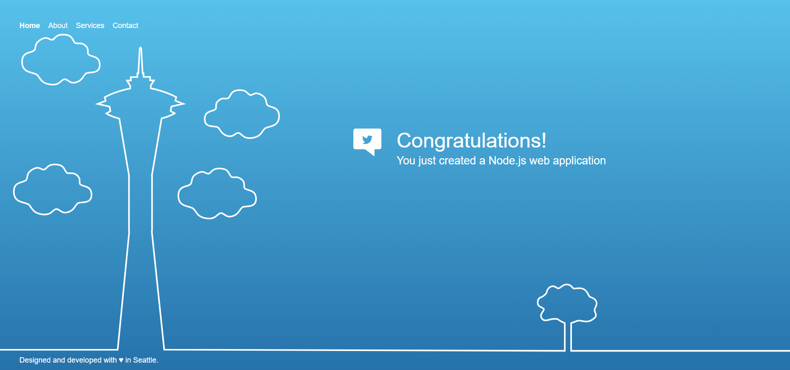

Services -> Development Tools -> CodeStar -> Start project -> It should notify you that you need to create a new IAM role for this, click it and it will create one for you. -> NodeJS -> 

- Project name (MyCodeStarApp)
- Repo name (MyCodeStarApp)
- which repo to use? (AWS CodeCommit)

Create project

Now if you go over to CloudFormation and select your stack, you can select events and see what is going on in the back end!

Once CloudFormation has built the backend resources we can click "view application" in CodeStar:

