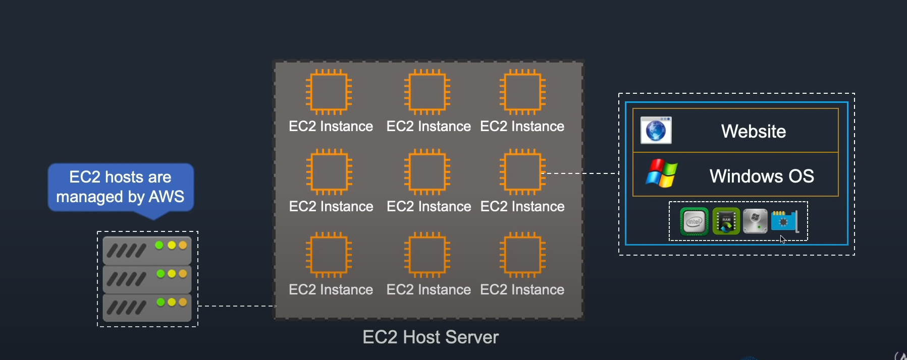
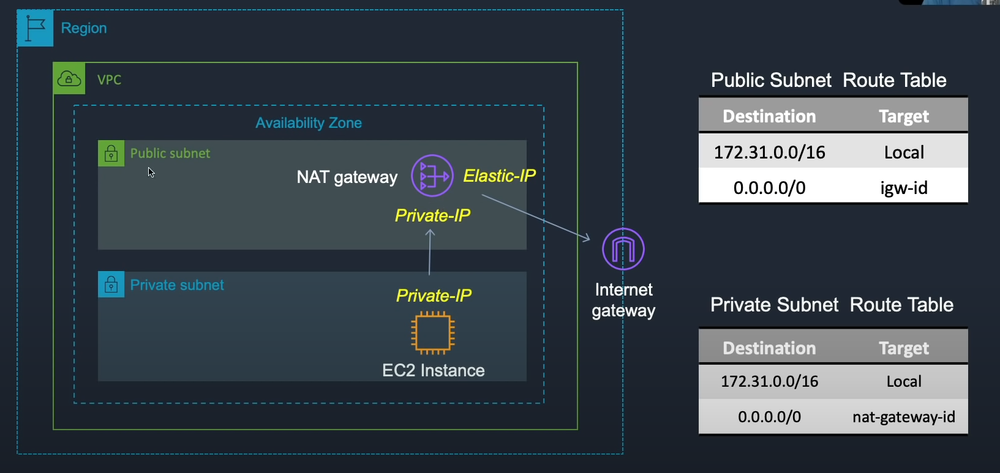

Amazon Elastic Compute Cloud (EC2)

Each EC2 instance is essentially a virtual machine hosted and managed by AWS hardware.
Each instance will have a certain amount of CPU, RAM, Drive space and Network bandwidth. It will then have an OS (Linux or Windows and apps that can be installed)

You can have 3 types of ip addresses 

Public, Private and Elastic.

Public ip addresses will change whenever you disconnect.

Private ip addresses will be retained.

Elastic ip addresses are static and will remain, you get charged if this ip is not being used

In order for your private subnet inside your VPC to be able to connect to the internet gateway, you need to use a Network Address Translation gateway (Nat gateway).

