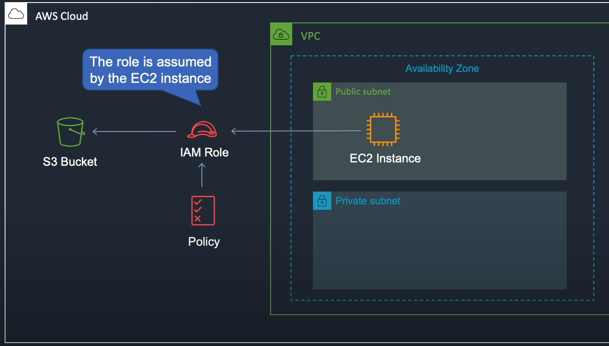

Let's say we have an EC2 instance running in a subnet and we want to connect to the S3 bucket. We can assign it an IAM role with a policy to deploy to the S3 bucket.

Go to services -> IAM -> roles -> create role -> EC2 (calls AWS services on your behalf) -> attach a permissions policy (S3 read only) -> next -> review -> name to S3 read only and create role.

AWS -> EC2 -> instances -> actions -> security -> modify IAM role -> pick the role you created and hit apply

You can also do this when creating an instance in step 3. There is a property named IAM role.