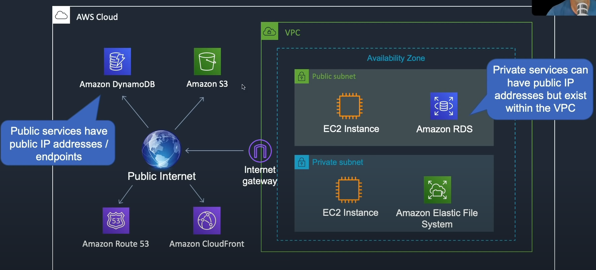

EC2 instances within a VPC are always private and require an internet gateway to connect to public services like the S3 bucket.

There is an advanced method of connecting to the public services privately.