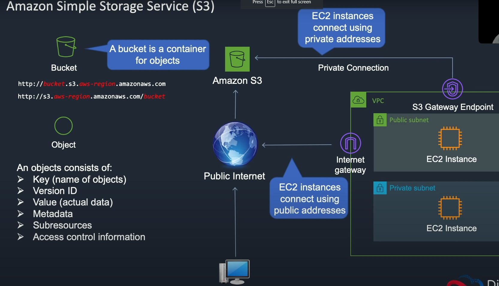

Amazon Simple Storage Service

This is an object based storage system
The "objects" are your files

The bucket name must be globally unique

The object must contain the following:

- Key (name of the objects)
- Version ID
- Value (actual data) 
- Metadata
- Access control information

You can also connect your EC2 instances using the internet gateway to the S3 bucket (see "Using roles EC2.md")



Creating an S3 bucket:

Services -> storage -> S3 -> Create bucket (s3-WhateverNameYouWant) -> next -> enable versioning -> next -> create bucket

Disable public blocking -> go to permissions and create a bucket policy to define who can access it.

"bucket-policy-public.json"

Copy the object from that file and paste it into the s3 bucket policy.

```
{"Version": "2008-10-17",
    "Statement": [{"Sid": "AllowPublicRead",
    "Effect": "Allow",
    "Principal": {
    "AWS": "*"
    },
    "Action": "s3:GetObject",
    "Resource": "arn:aws:s3:::BUCKETNAME/*"
    }
]
}
```