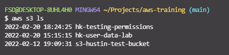

Pushing files up to your AWS S3 bucket via the CLI

```
aws configure
```

To view the buckets that you have created run:

```
aws s3 ls
```



"mys3object.txt"

Created a dummy file to push up.

```
aws s3 cp mys3object.txt s3://hk-testing-permissions/
```


Updating the version for a file change.

Change the text of the file we created and push it up via the CLI.


