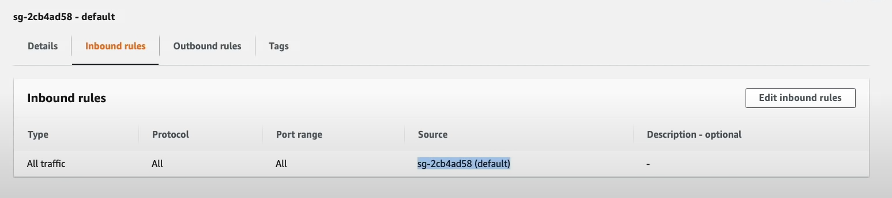
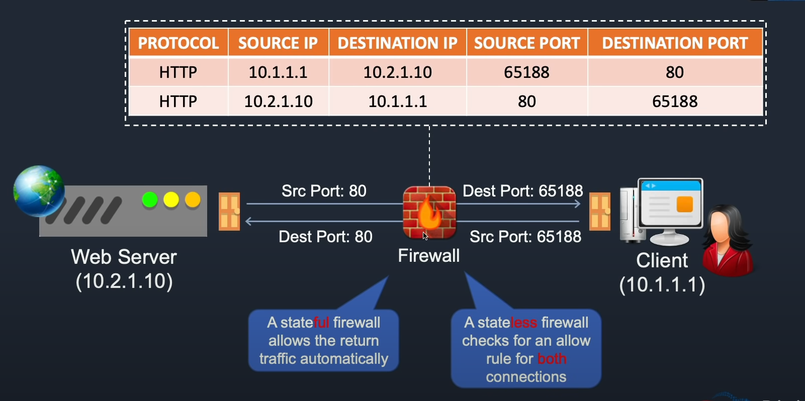

Security Groups & Network Access Control Lists (NACLs)

These are different types of firewalls used to protect your resources.

Security groups apply at an instance level (EC2)

VPC -> Network ACLs -> click on your VPC instance (be default there is one created)

You can edit the inbound/outbound rules

By default the NACL does not restrict any traffic.

You create security groups for each of your VPCs

Security Groups -> 

The source is set to allow the passing of data only within that security group. For outbound you can send traffic by default anywhere.

Example of stateful vs stateless firewalls