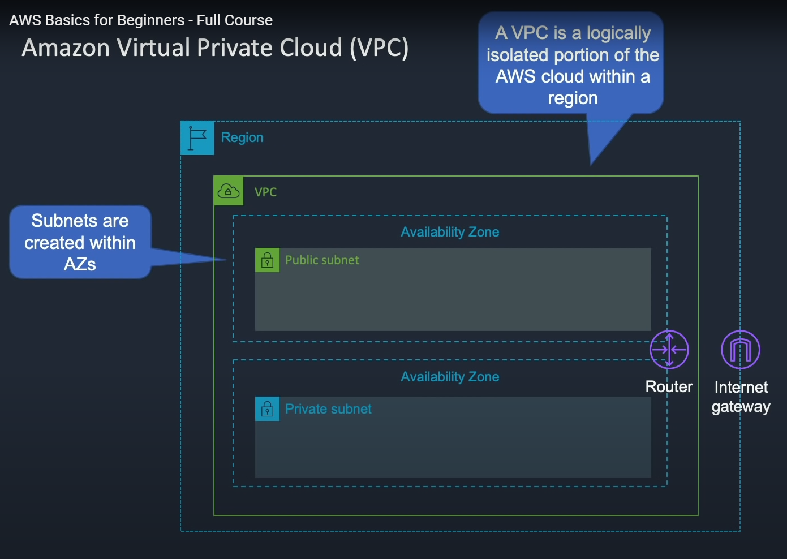
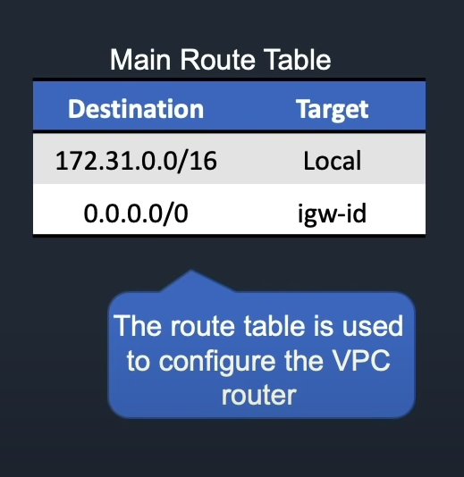
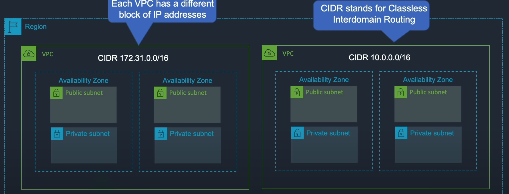
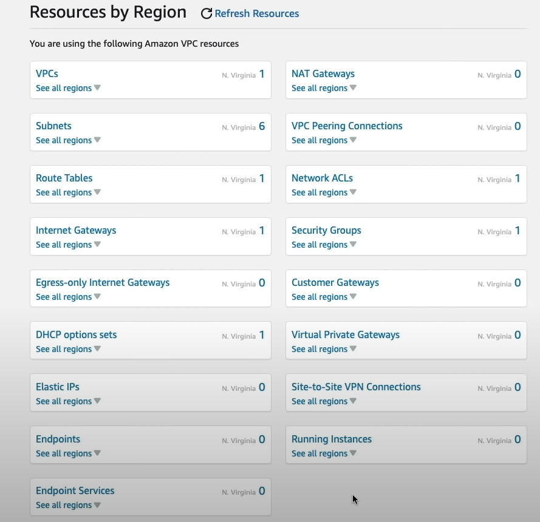

VPC Amazon Virtual Private Cloud

Each VPC is contained in a single Region. You can create subnets that use a router to pass data to each other

The VPC will have something called a "Main Route Table" where it has a destination address and a target of local and this is how all of the subnets of this VPC can communicate/send data to each other.

There is also another address that is 0.0.0.0/0 and it has a target of igw-id. This allows you to send data to the internet gateway and outside of the "Region".

You can store EC2 instances inside these subnets and these subnets can be set up as public or private.
Public meaning it is given a public ip address and can access the internet gateway.
Private meaning it is confidentially and cannot access the internet gateway, BUT there are ways around this.

You can have multiple VPC's inside or across Regions. Each VPC has a main address and the subnets are given unique child addresses.

Networking & Content Delivery -> VPC

By default we have 1 VPC in a region and 6 subnets. Right now I am connected to N.Virginia so I have 6 subnets, but if I were to change to Sydney I would have 5 available.

You VPC -> you can view your VPC (container) address and properties

Subnets -> You can view their unique child addresses

A public subnet that can connect to the internet gateway has an auto-assigned IPv4 address